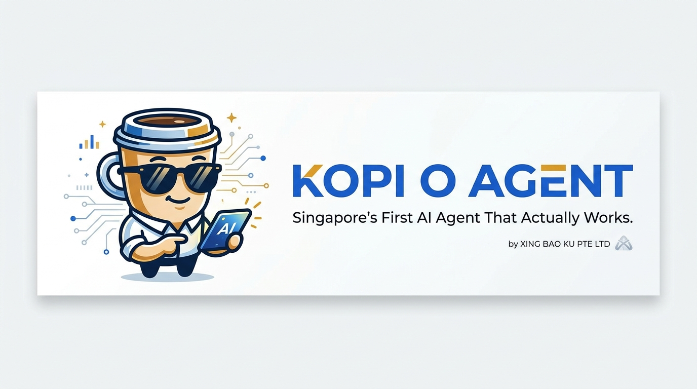

<p align="center">
  <picture>
    <source media="(prefers-color-scheme: dark)" srcset="landing/assets/banner.png">
    
  </picture>
</p>

<div align="center">

# ☕ KOPI AI Gateway

### Enterprise-grade intelligent routing and orchestration for LLM infrastructure

**Reduce AI costs by up to 60% • Improve reliability with automatic failover • Orchestrate 15+ providers through one unified API**

[](https://github.com/LINYIQ66/kopi-agent)
[](https://github.com/LINYIQ66/kopi-agent/blob/main/LICENSE)
[](https://www.python.org/)
[](https://github.com/LINYIQ66/kopi-agent)
[](https://kopi.readinghero.xyz/docs/)
[](https://kopi.readinghero.xyz)

[Quick Start](#-quick-start) • [Documentation](https://kopi.readinghero.xyz/docs/) • [Deploy with Docker](#-deployment) • [API Reference](https://kopi.readinghero.xyz/docs/api/)

</div>

---

**Stop wasting money on expensive LLM calls and juggling API keys across half a dozen providers.** KOPI automatically routes every request to the best-performing, most cost-efficient model — with built-in failover, semantic caching, PII masking, and enterprise billing. One integration. Full observability. Zero vendor lock-in.

---

## 🎯 Why KOPI?

| Feature | KOPI | OpenRouter | LiteLLM | Braintrust |
|---------|------|-----------|---------|------------|
| **Intelligent Routing** | ✅ Adaptive model selection per request | ❌ Static | Limited | ❌ |
| **Semantic Cache** | ✅ Vector-based retrieval | ❌ | ❌ | ❌ |
| **PII Masking** | ✅ Before external inference | ❌ | ❌ | ❌ |
| **Self-Hosted** | ✅ Full control | ❌ | ✅ | ❌ |
| **17+ Providers** | ✅ OpenAI, Claude, Gemini, DeepSeek, Llama, Qwen, MiMo... | ✅ | ✅ | ✅ |
| **20+ Messaging Platforms** | ✅ Telegram, WeChat, WhatsApp, Discord, SMS, Email... | ❌ | ❌ | ❌ |
| **Enterprise Billing** | ✅ Token tracking, cost allocation, per-customer | ❌ | Limited | ✅ |
| **Agent Loop** | ✅ Built-in autonomous agent (tool calling, multi-turn) | ❌ | ❌ | ❌ |
| **Flexible Routing** | ✅ Rate limit, cost, latency, priority, failover, weighted round-robin, model marketplace | Basic | Basic | ❌ |

---

## 🌟 Core Capabilities

### 🧠 Intelligent Model Routing
Automatically selects the optimal model for every request — balancing cost, latency, capability, and availability. Define routing rules by task type, user tier, or budget threshold.

```
Client Request → KOPI Gateway → Router
                                  ├── Default: MiMo v2.5 Pro (general reasoning)
                                  ├── Flash: DeepSeek v4 / MiMo v2 Flash (fast responses)
                                  ├── Strong: Claude Sonnet (complex reasoning)
                                  ├── Local: Ollama / vLLM (private data)
                                  └── Fallback: Nvidia NIM / OpenRouter (resilience)
```

### ⚡ Semantic Caching
Reduce repeated token costs by up to 80% through vector-based cache retrieval. Similar queries return cached responses automatically — no configuration needed.

### 🛡️ Reliability Layer
Built-in automatic failover across providers. If a model returns an error or times out, KOPI transparently retries on the next available provider. Zero downtime for your users.

### 🔒 Enterprise Security
PII masking before external inference. API keys stored at system level, invisible to end users. Self-hosted deployment keeps sensitive data within your infrastructure.

### 📊 Cost Analytics
Track token usage, cost per request, model distribution, and ROI — per customer, per team, or per service. Export to your existing observability stack.

### 🌐 Multi-Platform Gateway
Connect your AI to **20+ messaging platforms** — Telegram, WeChat, WhatsApp, Discord, SMS, Email, Signal, Matrix, Slack, and more. One agent, everywhere your users are.

### 🤖 Autonomous Agent Loop
Full agent execution with tool calling, multi-turn reasoning, session memory, and skill orchestration. KOPI doesn't just route — it *acts*.

### 🧩 80+ Pre-Built Skills
GitHub automation, YouTube analysis, Notion/Obsidian integration, PDF processing, stock market queries, code review, deployment, and more. Extend with custom plugins.

---

## 🏗️ Architecture

```
┌─────────────────────────────────────────────────────────────┐
│                        Your Application                      │
│           (CLI · Telegram · WeChat · Discord · API)          │
└──────────────────────────┬──────────────────────────────────┘
                           │
                     HTTP / WebSocket
                           │
                    ┌──────▼──────┐
                    │ KOPI Gateway │
                    │  (Platform   │
                    │   Adapters)  │
                    └──────┬──────┘
                           │
                    ┌──────▼──────┐
                    │    Router   │
                    │  (Rules +   │
                    │   Fallback) │
                    └──────┬──────┘
                           │
              ┌────────────┼────────────┐
              │            │            │
        ┌─────▼─────┐ ┌───▼───┐ ┌─────▼─────┐
        │ Intelligent│ │Semantic│ │  Cost &    │
        │  Router    │ │ Cache │ │ Observability│
        └─────┬─────┘ └───────┘ └─────┬─────┘
              │                       │
     ┌────────┼────────┬───────┐      │
     │        │        │       │      │
 ┌───▼──┐ ┌──▼──┐ ┌──▼──┐ ┌──▼──┐   │
 │OpenAI │ │Claude│ │Gemini│ │Deep‑│   │
 │  GPT  │ │ Son‑ │ │  2.5 │ │Seek │   │
 │  4.1  │ │ net  │ │ Flash│ │  V4 │   │
 └──────┘ └─────┘ └──────┘ └─────┘   │
                                       │
 ┌───▼──┐ ┌──▼──┐ ┌──▼──┐ ┌──▼──┐   │
 │Llama  │ │Qwen │ │ MiMo│ │Local│   │
 │  via  │ │ via │ │ v2.5│ │vLLM │   │
 │vLLM   │ │ API │ │  Pro│ │ Oll.│   │
 └──────┘ └─────┘ └─────┘ └─────┘   │
                                       │
 ┌─────────────────────────────────────▼─┐
 │         OpenRouter / Nvidia NIM       │
 │         (Fallback Tier)               │
 └───────────────────────────────────────┘
```

**Key Design Principles:**
- **No single point of failure** — every layer has fallback
- **Provider-agnostic routing** — models are interchangeable by config, not code
- **Privacy by default** — sensitive data stays on your infrastructure

---

## 🚀 Quick Start

### One-Command Install (Recommended)

```bash
curl -fsSL https://kopi.readinghero.xyz/install-siew-dai.sh | bash
```

In **3 minutes** you get:
- ✅ API key auto-provisioned — no signup, no credit card
- ✅ 80+ skills pre-installed and ready to use
- ✅ Telegram / WeChat gateway configurable post-install
- ✅ MiMo v2.5 Pro model included via KOPI Proxy

### Docker (Self-Hosted)

```bash
git clone https://github.com/LINYIQ66/kopi-agent.git
cd kopi-agent
cp .env.example .env
docker compose up -d
```

Then try it:

```bash
# CLI
docker exec -it kopi-agent kopi "What's the weather in Singapore?"

# API
curl -X POST http://localhost:8080/v1/chat/completions \
  -H "Authorization: Bearer $KOPI_API_KEY" \
  -d '{"model": "kopi-siew-dai", "messages": [{"role": "user", "content": "Hello"}]}'
```

### Python (pip)

```bash
pip install kopi-agent
kopi doctor   # verify installation
kopi          # start interactive session
```

---

## 💻 Usage Examples

```bash
# Interactive agent session
kopi

# One-shot task
kopi "Analyze this CSV and generate a summary report"

# Start multi-platform gateway
kopi gateway start

# Deploy Telegram bot
kopi gateway setup --platform telegram

# Check system health
kopi doctor

# View real-time logs
kopi logs --follow
```

```python
# Python API — embed KOPI in your application
from kopi import AIAgent

agent = AIAgent(
    model="kopi-siew-dai",
    base_url="https://kopi.readinghero.xyz/kp/v1"
)

response = agent.chat("Write a python script to rename all .jpg files in a directory")
print(response)
```

---

## 🎯 Use Cases

### 🏢 SME AI Employees
Power customer support, sales, and admin automation across Telegram, WeChat, and WhatsApp. Deploy AI agents that actually work with your existing tools — GitHub, Notion, Google Sheets, and more.

### 📈 Financial Research
Route quantitative analysis, market research, and reporting workloads to the right model. Process PDF reports, analyze spreadsheets, and generate summaries — all through one chat interface.

### 🔐 Enterprise AI Gateway
Centralize all LLM traffic under one roof with compliance controls, PII masking, cost tracking per department, and audit logs. Self-hosted for data sovereignty.

### 🛠️ DevOps Automation
Automate deployments, monitor servers, triage GitHub issues, review PRs, and manage infrastructure — all from your team chat or terminal.

### 🧪 AI Product Development
Built-in A/B testing across models, latency benchmarking, and cost profiling. Ship AI features with confidence knowing the numbers.

---

## 🧩 Supported Providers

| Provider | Models | Status |
|----------|--------|--------|
| OpenAI | GPT-4.1, GPT-4o, GPT-4o-mini | ✅ |
| Anthropic | Claude Sonnet 4, Claude Haiku | ✅ |
| Google | Gemini 2.5 Pro, Gemini 2.5 Flash | ✅ |
| DeepSeek | DeepSeek V4, V3 | ✅ |
| Meta (vLLM) | Llama 3.1, 3.2 | ✅ |
| MiMo | MiMo v2.5 Pro, v2 Flash | ✅ |
| Qwen | Qwen 2.5, QwQ | ✅ |
| Alibaba | Tongyi Qianwen | ✅ |
| OpenRouter | 300+ community models | ✅ |
| Nvidia NIM | Nemotron, Llama NIM | ✅ |
| Ollama | Local models | ✅ |
| Custom | Any OpenAI-compatible endpoint | ✅ |

---

## 📋 Platform Support

KOPI connects your AI to **20+ messaging platforms** through a unified gateway:

<details>
<summary><b>Messaging Platforms</b></summary>

| Category | Platforms |
|----------|-----------|
| **Instant Messaging** | Telegram, WhatsApp, WeChat, Discord, Signal, Matrix |
| **Enterprise** | Slack, Mattermost, Teams (via webhook), DingTalk, WeCom (企业微信) |
| **China Market** | WeChat (微信), Feishu/Lark (飞书), QQ Bot |
| **Voice/SMS** | Twilio SMS, Email (IMAP/SMTP), BlueBubbles |
| **Custom** | REST API, Webhook, Home Assistant |

</details>

Each platform adapter is a drop-in plugin — add a new platform in under an hour.

---

## 🧪 Testing

```bash
# Run test suite
cd kopi-agent && scripts/run_tests.sh

# Watch mode during development
pytest -f

# Run specific test categories
pytest tests/test_routing/ -v
pytest tests/test_gateway/ -v
```

✅ **17,000+ tests** across 900+ test files — continuously passing.

---

## 🛠️ Configuration

```yaml
# ~/.kopi/config.yaml
model:
  default: kopi-siew-dai
  provider: custom
  base_url: https://kopi.readinghero.xyz/kp/v1
  api_key: kp-xxxxx
  context_length: 256000

routing:
  fallback_enabled: true
  fallback_models:
    - kopi-gau
    - kopi-nemotron

agent:
  max_turns: 90
  skill_dirs:
    - ~/.kopi/skills/
    - ./skills/

gateway:
  platforms:
    telegram:
      enabled: true
      bot_token: "${TELEGRAM_BOT_TOKEN}"
    wechat:
      enabled: true

cache:
  semantic: true
  ttl: 3600

observability:
  cost_tracking: true
  log_level: info
```

---

## 🔧 Troubleshooting

| Problem | Solution |
|---------|----------|
| **Installation fails** | `sudo dpkg --configure -a` if dpkg interrupted |
| **401 Invalid API Key** | Run `kopi doctor` — verifies API key and proxy connectivity |
| **Gateway not responding** | `systemctl status kopi-gateway` or `journalctl -u kopi-gateway -f` |
| **Model returns errors** | KOPI automatically falls back — check `kopi logs` for routing details |
| **Docker issues** | Ensure ports 8080/8081 not in use; check `docker compose logs` |

---

## 🗺️ Roadmap

| Quarter | Focus |
|---------|-------|
| **Q2 2026** | ✅ Multi-provider routing · Semantic caching · PII masking · 20 platform adapters |
| **Q3 2026** | 🔄 Multi-agent orchestration · Advanced billing engine · Model marketplace |
| **Q4 2026** | 🚧 Enterprise SSO · Custom plugin marketplace · GPU-aware routing |
| **2027** | 🎯 Federated agent networks · Real-time voice gateway · Autonomous workflow builder |

---

## 📄 License

**MIT License** — free for personal, commercial, and enterprise use. See [LICENSE](LICENSE).

> Built by **Xing Bao Ku PTE LTD** · Singapore 🇸🇬
>
> We believe every company will run on AI. But AI infrastructure today is fragmented, expensive, and unreliable.
>
> **KOPI exists to become the intelligent routing layer powering the next generation of enterprise AI systems.**
>
> *Like kopi — simple, pure, effective. Less sugar, full power.* ☕

---

<p align="center">
  <a href="https://kopi.readinghero.xyz"><b>Website</b></a> •
  <a href="https://kopi.readinghero.xyz/docs/"><b>Documentation</b></a> •
  <a href="https://github.com/LINYIQ66/kopi-agent/discussions"><b>Discussions</b></a> •
  <a href="mailto:hello@kopiaiagent.com"><b>Contact</b></a>
</p>

## 🆕 v0.14.0 — PraisonAI-Inspired Features

### What's New

- **Doom Loop Detection** — Auto-recovery from stuck agents
- **Guardrails** — Input/output validation with rate limiting
- **Model Router** — Intelligent cost-optimized routing
- **Memory Enhancement** — Graph memory + short/long-term separation
- **Checkpoint/Rollback** — Auto-save before code changes, rollback on error
- **Session Management** — Auto-save and resume on restart
- **MCP Auto-Discovery** — Automatic tool discovery from MCP servers
- **macOS Support** — One-click install on iMac/MacBook

### Installation

```bash
# VPS (Linux) or iMac (macOS)
curl -fsSL https://kopiaiagent.com/install.sh | bash
```

### Configuration

```yaml
# ~/.kopi/config.yaml

# Model Router — auto-select cheapest model
model_router:
  enabled: true
  strategy: cost_optimized
  routes:
    simple: kopi-flash      # DeepSeek V4 Flash (free)
    coding: kopi-grok       # Grok 4.3 (MCP)
    reasoning: kopi-grok    # Grok 4.3 (MCP)
    standard: kopi-o-pro    # MiMo V2 Pro

# Doom Loop Detection
safety:
  doom_loop_detection: true
  max_same_tool_calls: 3
  auto_recovery: true

# Guardrails
guardrails:
  enabled: true
  rate_limit:
    max_requests_per_minute: 30
    max_tokens_per_hour: 500000
